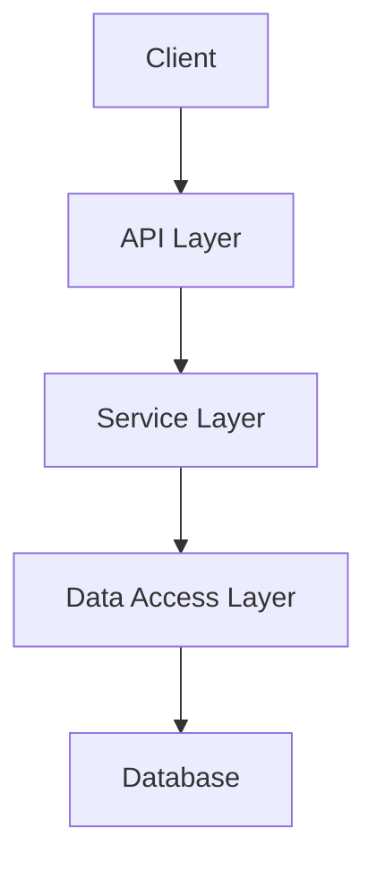
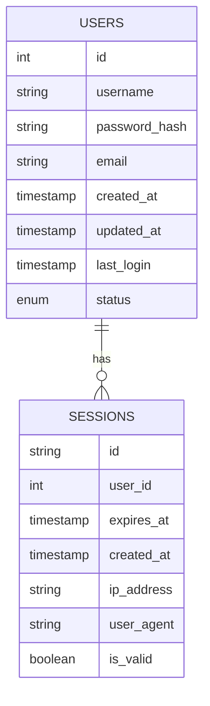

# StockBotWar Web Application

## Overview
StockBotWar is a full-stack web application that serves as a platform for automated trading and community-driven investment strategies. The application consists of a Next.js frontend and a Python backend, containerized using Docker for easy deployment and scalability.

The application is designed as part of a larger microservices architecture, where each component has a specific responsibility and communicates with others through well-defined APIs. This modular approach allows for independent scaling, development, and deployment of different parts of the system.

## Table of Contents
- [Project Structure](#project-structure)
- [Technology Stack](#technology-stack)
- [Architecture Overview](#architecture-overview)
- [Getting Started](#getting-started)
- [Development Guide](#development-guide)
- [API Documentation](#api-documentation)
- [Database Schema](#database-schema)
- [State Management](#state-management)
- [Authentication Flow](#authentication-flow)
- [Contributing Guidelines](#contributing-guidelines)
- [Deployment](#deployment)
- [Troubleshooting](#troubleshooting)
- [Development Commands and Debugging](#development-commands-and-debugging)

## Project Structure
```
feature-WebApp/
├── frontend/                 # Next.js frontend application
│   ├── src/
│   │   ├── components/      # Reusable UI components
│   │   ├── pages/          # Page components and routing
│   │   ├── lib/            # Utility functions and helpers
│   │   └── api/            # API route handlers
│   ├── public/             # Static files
│   └── [Next.js config]    # Configuration files
│
├── backend/                 # Python backend application
│   ├── app/                # Main application code
│   ├── database/           # Database models and utilities
│   ├── utils/             # Helper functions
│   ├── app.py             # Main application entry
│   └── requirements.txt    # Python dependencies
```

### Directory Structure Explained

#### Frontend Structure
- **src/components/**: Contains reusable React components following atomic design principles. Components are organized by complexity (atoms, molecules, organisms) and feature domains.
- **src/pages/**: Next.js pages that define routes and page layouts. Each file corresponds to a route in the application.
- **src/lib/**: Utility functions, custom hooks, and shared logic. This includes API clients, authentication helpers, and data transformation utilities.
- **src/api/**: API route handlers for server-side operations. These handlers can interact with the database and external services securely.
- **public/**: Static assets like images, fonts, and other files that need to be served directly.

#### Backend Structure
- **app/**: Core application logic, route handlers, and business logic implementation.
- **database/**: Database models, migrations, and connection management. Uses SQLAlchemy for ORM.
- **utils/**: Helper functions, middleware, and shared utilities.
- **app.py**: Application entry point that sets up the Flask application and middleware.

## Technology Stack

### Frontend Technologies

#### Next.js 14
Next.js is a React framework that provides:
- **Server-Side Rendering (SSR)**: Improves initial page load performance and SEO
- **Static Site Generation (SSG)**: Pre-renders pages at build time for optimal performance
- **API Routes**: Enables backend functionality within the frontend application
- **File-based Routing**: Simplifies route management through file system structure
- **Built-in TypeScript Support**: Ensures type safety and better developer experience

#### Material-UI (MUI)
A comprehensive React UI framework that provides:
- **Pre-built Components**: Ready-to-use, customizable React components
- **Theming System**: Consistent styling across the application
- **Responsive Design**: Built-in mobile-first approach
- **CSS-in-JS**: Scoped styling solution with emotion
- **Accessibility**: ARIA-compliant components out of the box

#### TypeScript
A typed superset of JavaScript that:
- Provides static type checking
- Enables better IDE support and code completion
- Reduces runtime errors through compile-time checks
- Improves code maintainability and refactoring

#### TailwindCSS
A utility-first CSS framework that:
- Provides low-level utility classes
- Enables rapid UI development
- Ensures consistent styling
- Optimizes production builds by purging unused styles

### Backend Technologies

#### Python with Flask
A lightweight WSGI web application framework that:
- Provides routing and request handling
- Offers extensive middleware support
- Integrates well with SQLAlchemy and other libraries
- Enables RESTful API development

#### SQLAlchemy ORM
An SQL toolkit and ORM that:
- Provides database abstraction
- Manages database connections and pooling
- Enables type-safe database queries
- Supports database migrations and schema management

#### MySQL Database
A robust relational database that:
- Ensures data integrity through ACID compliance
- Provides efficient querying capabilities
- Supports complex relationships between data
- Offers good performance for read-heavy operations

#### Docker
Containerization platform that:
- Ensures consistent environments
- Simplifies deployment
- Enables easy scaling
- Facilitates microservices architecture

## Architecture Overview

### Frontend Architecture

The frontend follows a component-based architecture with:

1. **Component Layer**
   - Presentational Components: Handle UI rendering
   - Container Components: Manage state and data fetching
   - Layout Components: Define page structure

2. **State Management**
   - React Context: For global state management
   - Local State: For component-specific state
   - Server State: Managed through React Query

3. **Data Flow**
   ```
   User Action → Component → API Client → Backend API
        ↑          ↓
   UI Update ← State Update
   ```

4. **Routing System**
   - File-based routing through Next.js
   - Dynamic routes for user-specific pages
   - API routes for backend functionality

### Backend Architecture

The backend follows a layered architecture:

1. **API Layer**
   - Route handlers
   - Request validation
   - Response formatting

2. **Service Layer**
   - Business logic
   - Data processing
   - External service integration

3. **Data Access Layer**
   - Database operations
   - Data models
   - Query optimization

4. **Infrastructure Layer**
   - Database connection
   - Caching
   - Logging



## Getting Started

### Prerequisites
- Node.js (v18 or later)
- Python 3.8+
- Docker and Docker Compose
- MySQL

### Local Development Setup

1. **Clone the repository**
   ```bash
   git clone [repository-url]
   cd feature-WebApp
   ```

2. **Frontend Setup**
   ```bash
   cd frontend
   npm install
   npm run dev
   ```
   The frontend will be available at http://localhost:3000

3. **Backend Setup**
   ```bash
   cd backend
   python -m venv venv
   source venv/bin/activate  # On Windows: .\venv\Scripts\activate
   pip install -r requirements.txt
   python app.py
   ```
   The backend will be available at http://localhost:5000

### Environment Configuration

Create a `.env.local` file in the frontend directory:
```env
NEXT_PUBLIC_API_URL=http://localhost:5000
NEXT_PUBLIC_ENV=development
```

Create a `.env` file in the backend directory:
```env
FLASK_ENV=development
FLASK_DEBUG=1
MYSQL_HOST=localhost
MYSQL_USER=your_user
MYSQL_PASSWORD=your_password
MYSQL_DATABASE=your_database
```

## Development Guide

### Adding New Frontend Features

1. **Creating New Components**
   ```typescript
   // src/components/MyComponent.tsx
   import React from 'react';
   import { styled } from '@mui/material/styles';
   
   interface MyComponentProps {
     title: string;
     onAction?: () => void;
   }
   
   const StyledComponent = styled('div')(({ theme }) => ({
     padding: theme.spacing(2),
     backgroundColor: theme.palette.background.paper,
   }));
   
   export const MyComponent: React.FC<MyComponentProps> = ({ 
     title,
     onAction 
   }) => {
     return (
       <StyledComponent onClick={onAction}>
         {title}
       </StyledComponent>
     );
   };
   ```

2. **Adding New Pages**
   ```typescript
   // src/app/my-page/page.tsx
   import { Metadata } from 'next';
   
   export const metadata: Metadata = {
     title: 'My Page',
     description: 'Description for SEO',
   };
   
   export default function MyPage() {
     return (
       <div className="container mx-auto p-4">
         <h1 className="text-2xl font-bold">My New Page</h1>
         {/* Page content */}
       </div>
     );
   }
   ```

3. **Making API Calls**
   ```typescript
   // src/lib/api.ts
   import axios from 'axios';
   
   const api = axios.create({
     baseURL: process.env.NEXT_PUBLIC_API_URL,
     headers: {
       'Content-Type': 'application/json',
     },
   });
   
   export async function fetchData<T>(endpoint: string): Promise<T> {
     try {
       const response = await api.get<T>(endpoint);
       return response.data;
     } catch (error) {
       console.error('API Error:', error);
       throw error;
     }
   }
   ```

### Adding New Backend Features

1. **Creating API Endpoints**
   ```python
   from flask import Blueprint, jsonify, request
   from .models import MyModel
   from .schemas import MySchema
   from database import get_db

   bp = Blueprint('my_feature', __name__)
   schema = MySchema()

   @bp.route('/api/my-endpoint', methods=['GET'])
   def get_items():
       try:
           db = get_db()
           items = db.query(MyModel).all()
           return jsonify({
               'status': 'success',
               'data': schema.dump(items, many=True)
           }), 200
       except Exception as e:
           return jsonify({
               'status': 'error',
               'message': str(e)
           }), 500
   ```

2. **Database Operations**
   ```python
   from sqlalchemy.orm import Session
   from typing import Optional, List
   from .models import MyModel

   class MyRepository:
       def __init__(self, db: Session):
           self.db = db

       def create(self, data: dict) -> MyModel:
           item = MyModel(**data)
           self.db.add(item)
           self.db.commit()
           self.db.refresh(item)
           return item

       def get_by_id(self, id: int) -> Optional[MyModel]:
           return self.db.query(MyModel).filter(MyModel.id == id).first()

       def list_all(self) -> List[MyModel]:
           return self.db.query(MyModel).all()
   ```

## API Documentation

### Authentication Flow

1. **Registration Process**
   ```mermaid
   sequenceDiagram
       Client->>+Server: POST /api/auth/register
       Server->>+Database: Check if user exists
       Database-->>-Server: User status
       Server->>+Database: Create user if not exists
       Database-->>-Server: User created
       Server-->>-Client: Success/Error response
   ```

2. **Login Process**
   ```mermaid
   sequenceDiagram
       Client->>+Server: POST /api/auth/login
       Server->>+Database: Verify credentials
       Database-->>-Server: User data
       Server->>Server: Generate JWT
       Server-->>-Client: JWT Token
   ```

### Authentication Endpoints
- `POST /api/auth/register`: Create new user account
  ```json
  // Request
  {
    "username": "string",
    "password": "string",
    "email": "string"
  }
  
  // Response 200
  {
    "status": "success",
    "data": {
      "id": "number",
      "username": "string",
      "email": "string"
    }
  }
  
  // Response 400
  {
    "status": "error",
    "message": "Validation error message"
  }
  ```

- `POST /api/auth/login`: User login
  ```json
  // Request
  {
    "username": "string",
    "password": "string"
  }
  
  // Response 200
  {
    "status": "success",
    "data": {
      "token": "string",
      "user": {
        "id": "number",
        "username": "string"
      }
    }
  }
  ```

### User Endpoints
- `GET /api/user/profile`: Get user profile
  - Requires Authentication Header: `Authorization: Bearer <token>`
- `PUT /api/user/profile`: Update user profile
  - Requires Authentication Header: `Authorization: Bearer <token>`

## Database Schema

### Users Table
```sql
CREATE TABLE users (
    id INT PRIMARY KEY AUTO_INCREMENT,
    username VARCHAR(255) UNIQUE NOT NULL,
    password_hash VARCHAR(255) NOT NULL,
    email VARCHAR(255) UNIQUE NOT NULL,
    created_at TIMESTAMP DEFAULT CURRENT_TIMESTAMP,
    updated_at TIMESTAMP DEFAULT CURRENT_TIMESTAMP ON UPDATE CURRENT_TIMESTAMP,
    last_login TIMESTAMP NULL,
    status ENUM('active', 'inactive', 'suspended') DEFAULT 'active',
    INDEX idx_username (username),
    INDEX idx_email (email)
);
```

### Sessions Table
```sql
CREATE TABLE sessions (
    id VARCHAR(255) PRIMARY KEY,
    user_id INT NOT NULL,
    expires_at TIMESTAMP NOT NULL,
    created_at TIMESTAMP DEFAULT CURRENT_TIMESTAMP,
    ip_address VARCHAR(45),
    user_agent TEXT,
    is_valid BOOLEAN DEFAULT TRUE,
    FOREIGN KEY (user_id) REFERENCES users(id) ON DELETE CASCADE,
    INDEX idx_user_id (user_id),
    INDEX idx_expires_at (expires_at)
);
```

### Database Relationships


## State Management

### Frontend State Management

1. **Global State**
   ```typescript
   // src/context/AuthContext.tsx
   import { createContext, useContext, useState } from 'react';
   
   interface AuthState {
     user: User | null;
     token: string | null;
   }
   
   export const AuthContext = createContext<AuthState>(null!);
   
   export function AuthProvider({ children }) {
     const [auth, setAuth] = useState<AuthState>({
       user: null,
       token: null,
     });
   
     return (
       <AuthContext.Provider value={auth}>
         {children}
       </AuthContext.Provider>
     );
   }
   ```

2. **API State Management**
   ```typescript
   // src/hooks/useData.ts
   import { useQuery, useMutation } from 'react-query';
   import { api } from '../lib/api';
   
   export function useData<T>(endpoint: string) {
     return useQuery<T>(['data', endpoint], () =>
       api.get(endpoint).then(res => res.data)
     );
   }
   ```

### Backend State Management

1. **Session Management**
   ```python
   from datetime import datetime, timedelta
   from database import get_db
   
   class SessionManager:
       def __init__(self, db):
           self.db = db
   
       def create_session(self, user_id: int, ip_address: str) -> str:
           session_id = generate_session_id()
           expires_at = datetime.utcnow() + timedelta(days=7)
           
           session = Session(
               id=session_id,
               user_id=user_id,
               expires_at=expires_at,
               ip_address=ip_address
           )
           
           self.db.add(session)
           self.db.commit()
           
           return session_id
   ```

## Contributing Guidelines

1. **Branch Naming Convention**
   - Feature: `feature/description`
   - Bug Fix: `fix/description`
   - Documentation: `docs/description`
   - Example: `feature/user-authentication`

2. **Commit Message Format**
   ```
   type(scope): description
   
   [optional body]
   
   [optional footer]
   ```
   Types:
   - feat: New feature
   - fix: Bug fix
   - docs: Documentation changes
   - style: Code style changes
   - refactor: Code refactoring
   - test: Adding tests
   - chore: Maintenance tasks

3. **Pull Request Process**
   - Create feature branch from `develop`
   - Make changes following style guidelines
   - Write/update tests
   - Update documentation
   - Submit PR with description
   - Wait for review
   - Address review comments
   - Merge after approval

4. **Code Style Guidelines**
   - Frontend:
     ```typescript
     // Use functional components
     // Use TypeScript interfaces
     // Follow ESLint rules
     // Use proper component organization
     ```
   - Backend:
     ```python
     # Follow PEP 8
     # Use type hints
     # Document functions
     # Write unit tests
     ```

## Deployment

The application is deployed using Docker Compose and integrates with the existing microservice architecture. Environment variables are managed through Portainer.

### Required Environment Variables
```
# Database Configuration
MYSQL_ROOT_PASSWORD=<root-password>
MYSQL_DATABASE=<database-name>
MYSQL_USER=<user>
MYSQL_PASSWORD=<password>

# Backend Configuration
FLASK_ENV=production
FLASK_SECRET_KEY=<secret-key>
JWT_SECRET_KEY=<jwt-secret>

# Frontend Configuration
NEXT_PUBLIC_API_URL=<api-url>
```

### Deployment Process
1. Build Docker images
2. Push to registry
3. Update Docker Compose
4. Deploy through Portainer

### Security Considerations
- Use secure environment variables
- Implement rate limiting
- Enable CORS protection
- Use HTTPS
- Implement proper authentication
- Regular security audits

## Troubleshooting

### Common Issues

1. **Database Connection Issues**
   - Check environment variables
   - Verify database service is running
   - Check network configuration
   - Common errors and solutions:
     ```
     Error: Connection refused
     Solution: Check if database is running and accessible
     
     Error: Authentication failed
     Solution: Verify credentials in environment variables
     ```

2. **Frontend Build Errors**
   - Clear `.next` directory
   - Delete `node_modules` and reinstall
   - Check TypeScript errors
   - Common build issues:
     ```
     Error: Module not found
     Solution: Check import paths and dependencies
     
     Error: Type error
     Solution: Verify TypeScript types and interfaces
     ```

3. **Backend Startup Issues**
   - Verify Python version
   - Check virtual environment
   - Verify all dependencies installed
   - Common Python issues:
     ```
     Error: Module not found
     Solution: Install missing package
     
     Error: Port already in use
     Solution: Kill process using port or change port
     ```

### Debug Mode
```bash
# Frontend
npm run dev -- --debug

# Backend
python app.py --debug
```

### Logging
```python
# Backend logging configuration
import logging

logging.basicConfig(
    level=logging.DEBUG,
    format='%(asctime)s - %(name)s - %(levelname)s - %(message)s',
    handlers=[
        logging.FileHandler('debug.log'),
        logging.StreamHandler()
    ]
)
```

## Support
For additional support or questions:
1. Check existing documentation
2. Search closed issues
3. Open new issue with:
   - Description of problem
   - Steps to reproduce
   - Expected vs actual behavior
   - Environment details

## Performance Optimization

### Frontend Optimization
1. Code splitting
2. Image optimization
3. Lazy loading
4. Caching strategies

### Backend Optimization
1. Database indexing
2. Query optimization
3. Caching
4. Connection pooling

## Development Commands and Debugging

### Frontend Commands

#### Basic Commands
```bash
# Start development server
npm run dev

# Build for production
npm run build

# Start production server
npm start

# Run linting
npm run lint

# Run linting with auto-fix
npm run lint:fix

# Run type checking
npm run type-check

# Clear Next.js cache
rm -rf .next
```

#### Testing Commands
```bash
# Run all tests
npm test

# Run tests in watch mode
npm test:watch

# Run tests with coverage
npm test:coverage

# Run specific test file
npm test -- path/to/test-file.test.tsx
```

#### Debugging Frontend

1. **Browser DevTools**
   - Use React DevTools extension for component debugging
   - Use Network tab for API request monitoring
   - Use Console for logging
   - Use Sources tab for breakpoint debugging

2. **VS Code Debugging**
   ```json
   // .vscode/launch.json
   {
     "version": "0.2.0",
     "configurations": [
       {
         "type": "chrome",
         "request": "launch",
         "name": "Next.js: Debug Frontend",
         "url": "http://localhost:3000",
         "webRoot": "${workspaceFolder}/frontend"
       }
     ]
   }
   ```

3. **Component Debugging**
   ```typescript
   // Add React Developer Tools debug points
   <div className="debug-component">
     {process.env.NODE_ENV === 'development' && (
       <pre>{JSON.stringify(props, null, 2)}</pre>
     )}
   </div>
   ```

### Backend Commands

#### Basic Commands
```bash
# Activate virtual environment
source venv/bin/activate  # Unix
.\venv\Scripts\activate  # Windows

# Install dependencies
pip install -r requirements.txt

# Start development server
python app.py

# Start with debug mode
python app.py --debug

# Start with specific port
python app.py --port 5001

# Run with auto-reload
python app.py --reload
```

#### Database Commands
```bash
# Create database tables
python manage.py db init
python manage.py db migrate
python manage.py db upgrade

# Reset database
python manage.py db downgrade base

# Generate migration
python manage.py db migrate -m "migration_description"
```

#### Testing Commands
```bash
# Run all tests
pytest

# Run specific test file
pytest tests/test_file.py

# Run tests with coverage
pytest --cov=app tests/

# Run tests in parallel
pytest -n auto

# Generate coverage report
pytest --cov=app --cov-report=html tests/
```

#### Debugging Backend

1. **Python Debugger (pdb)**
   ```python
   # Add breakpoint in code
   import pdb; pdb.set_trace()
   
   # Or use Python 3.7+ breakpoint()
   breakpoint()
   ```

2. **VS Code Debugging**
   ```json
   // .vscode/launch.json
   {
     "version": "0.2.0",
     "configurations": [
       {
         "name": "Python: Flask",
         "type": "python",
         "request": "launch",
         "module": "flask",
         "env": {
           "FLASK_APP": "app.py",
           "FLASK_ENV": "development"
         },
         "args": ["run", "--no-debugger"],
         "jinja": true
       }
     ]
   }
   ```

3. **Logging**
   ```python
   # Add detailed logging
   import logging
   logging.basicConfig(
       level=logging.DEBUG,
       format='%(asctime)s - %(name)s - %(levelname)s - %(message)s',
       handlers=[
           logging.FileHandler('debug.log'),
           logging.StreamHandler()
       ]
   )
   
   # Usage
   logger = logging.getLogger(__name__)
   logger.debug("Debug message")
   logger.info("Info message")
   logger.error("Error message")
   ```

### Docker Commands

#### Development
```bash
# Build and start all services
docker-compose -f docker-compose.dev.yml up --build

# Start specific service
docker-compose -f docker-compose.dev.yml up frontend

# View logs
docker-compose -f docker-compose.dev.yml logs -f

# Stop all services
docker-compose -f docker-compose.dev.yml down

# Remove volumes
docker-compose -f docker-compose.dev.yml down -v
```

#### Production
```bash
# Build production images
docker-compose build

# Start production stack
docker-compose up -d

# Check service status
docker-compose ps

# View logs
docker-compose logs -f

# Stop production stack
docker-compose down
```

#### Debugging Docker

1. **Container Shell Access**
   ```bash
   # Access frontend container
   docker-compose exec frontend sh

   # Access backend container
   docker-compose exec backend bash
   ```

2. **View Container Logs**
   ```bash
   # View real-time logs
   docker-compose logs -f service_name

   # View last N lines
   docker-compose logs --tail=100 service_name
   ```

3. **Check Resource Usage**
   ```bash
   # View container stats
   docker stats

   # View running processes
   docker-compose top
   ```

### Common Development Tasks

1. **Adding New Dependencies**
   ```bash
   # Frontend
   npm install package-name
   
   # Backend
   pip install package-name
   pip freeze > requirements.txt
   ```

2. **Database Operations**
   ```bash
   # Create new migration
   flask db migrate -m "description"
   
   # Apply migrations
   flask db upgrade
   
   # Rollback migration
   flask db downgrade
   ```

3. **Running Tests**
   ```bash
   # Run all tests
   npm run test        # Frontend
   pytest              # Backend
   
   # Run with coverage
   npm run test:coverage  # Frontend
   pytest --cov=app      # Backend
   ```

---

Remember to keep this documentation up to date as the project evolves. Good documentation is crucial for project maintainability and onboarding new developers. 